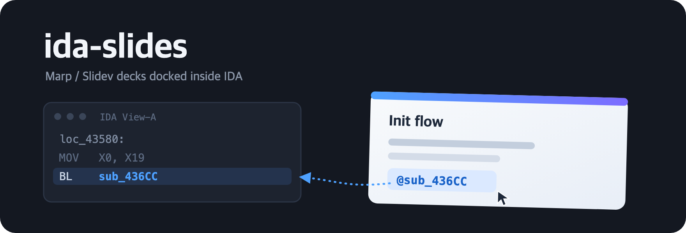

<p align="center">
  
</p>

English | [한국어](README_ko.md)

# ida-slides

Real **Marp** or **Slidev** slide decks inside a dockable IDA Pro tab — with
`@name` tokens rendered as clickable links that jump the disassembly view.

Present your analysis with the slides docked on the right and the code on the
left. Write `@sub_401000`, `@main`, or `@0x401000` anywhere in the deck and it
becomes a highlighted link; clicking it navigates IDA to that function or
address.

## Usage

1. `Ctrl+Shift+M` (or View → Open subviews → ida-slides: Open Slides…)
2. Pick your Markdown deck (`.md`)

On macOS the deck renders in a native WKWebView embedded in the IDA tab — no
QtWebEngine required. The engine is picked per deck:

- **Marp** (default): the `marp` CLI converts to HTML on every save and the
  view reloads in place, keeping the current slide. Full Marp themes,
  backgrounds, pagination.
- **Slidev**: chosen when the front matter has Slidev-specific keys
  (`transition:`, `mdc:`, `drawings:` …). ida-slides starts a local `slidev`
  dev server and shows it in the tab; Vite HMR applies saves instantly.

Force an engine by putting `ida-slides-engine: marp` or `ida-slides-engine: slidev`
in the front matter. Navigate with each tool's usual keys (←/→, `f`
fullscreen, Slidev's `o` overview, …).

Requirements:

- Marp: `npm i -g @marp-team/marp-cli`
- Slidev: `npm i -g @slidev/cli` (+ the theme your deck uses, e.g.
  `@slidev/theme-default`)
- pyobjc-framework-WebKit (installed automatically by the Plugin Manager;
  manual: `pip install --user pyobjc-framework-WebKit`)

CLIs are found via PATH, nvm, or Homebrew. `.html` files exported by marp-cli
can also be opened directly.

### Platform support

**macOS only** — the pipeline (marp/slidev CLI + embedded web view)
relies on the native WKWebView, and rendering requires the matching CLI
to be installed. There is no fallback viewer: on other platforms, or
without marp/slidev, the plugin loads but decks don't render.

## `@` reference syntax

| Syntax | In a slide it becomes… |
|--------|------------------------|
| `@sub_401000` / `@main` / `@0x401000` | a link that jumps the disassembly view |
| `@main:12` | a link that opens the pseudocode at line 12 |
| `@main[1:8]` | the decompiled lines 1–8, embedded as a code block |
| `@main[7]` | just pseudocode line 7 |
| `@main[]` | the whole decompiled function |
| `@main[1:8@5]` | lines 1–8 with line 5 marked `►` |

Hover any `@` link to preview its decompiled code in a tooltip (a few lines,
with `►` on the `:line` target) without leaving the slide — handy for
checking "which function was that again?" mid-talk.

Line jumps (`:N`) and embeds (`[a:b]`) both read live from the IDB, so a
rename or re-analysis is reflected the next time you save. Unknown names are
reported in IDA's output window when clicked.

Every load and save also lints the whole deck against the open IDB: if any
`@reference` no longer resolves (renamed function, wrong IDB open), the
toolbar status shows `⚠ N unresolved @ref(s)` — hover it for the list, or
see the Output window — so you catch broken references before the talk, not
during it.

Going the other way: right-click in the disassembly, pseudocode, or hex view
and pick **Copy @reference** — the token for that spot lands on the
clipboard, ready to paste into your deck. Select several pseudocode lines
first and it captures the range as an embed token `@name[lo:hi]`; otherwise
it copies `@name:line` (pseudocode) or `@name`. Unnamed addresses — and
names the `@` token grammar can't express, like Objective-C selectors —
are copied as `@0xADDR` so the token always works when pasted.

Jumps never take keyboard focus away from the deck, so you keep driving
slides with the arrow keys without clicking back in.

## Writing decks

Each engine's standard conventions apply (front matter, `---` separators,
themes, layouts). `@name` linkification runs on the rendered DOM — a
MutationObserver keeps Slidev's dynamically mounted slides covered — so it
works in body text and inline code alike. See `examples/sample-marp.md` and
`examples/sample-slidev.md`.

Before a deck reaches the engine, ida-slides preprocesses it into a hidden
`.<name>.ida-slides.md` sibling (expanding `[a:b]` embeds); Marp additionally
renders a `.<name>.ida-slides.html`. Both sit next to your `.md` so relative
image paths keep working, and both are removed when the deck is closed. The
Slidev dev server is stopped when the deck is closed or swapped.

## Install

Symlink or copy this directory into your IDA plugins folder, e.g.:

```sh
ln -s "$(pwd)" ~/.idapro/plugins/ida-slides
```

Requires IDA 9.2+ (GUI).

## Tests

The plugin is tied to IDA/Qt/WebKit, so tests run inside IDA rather than
under a bare `pytest`. Open any IDB, then in the IDA Python console:

```python
exec(open("<repo>/tests/test_in_ida.py", encoding="utf-8").read())
```

Pure-logic checks (token grammar, slide splitting, front-matter parsing,
embed/lint handling) always run; database-dependent checks (name
resolution, decompilation, live lint) pick a function from whatever IDB is
open and skip cleanly if none is loaded.

## Implementation notes (IDA 9.3)

- `PluginForm.FormToPySideWidget` requires `QtGui` in `__main__` and fails
  with a *silently swallowed* AttributeError otherwise; this plugin uses
  `FormToPyQtWidget` (shiboken `wrapInstance`) which works in any context.
- WebKit completion-handler blocks are not callable from PyObjC delegate
  methods here ("cannot call block without a signature"), and WebKit aborts
  the host process when a decision handler is dropped — so click routing uses
  a `WKScriptMessageHandler` + `WKUserScript` click interceptor instead of
  `decidePolicyForNavigationAction`. No delegate method that receives a block
  is implemented.
- All IDA API work triggered from ObjC callbacks is deferred via
  `QTimer.singleShot(0, …)`.
